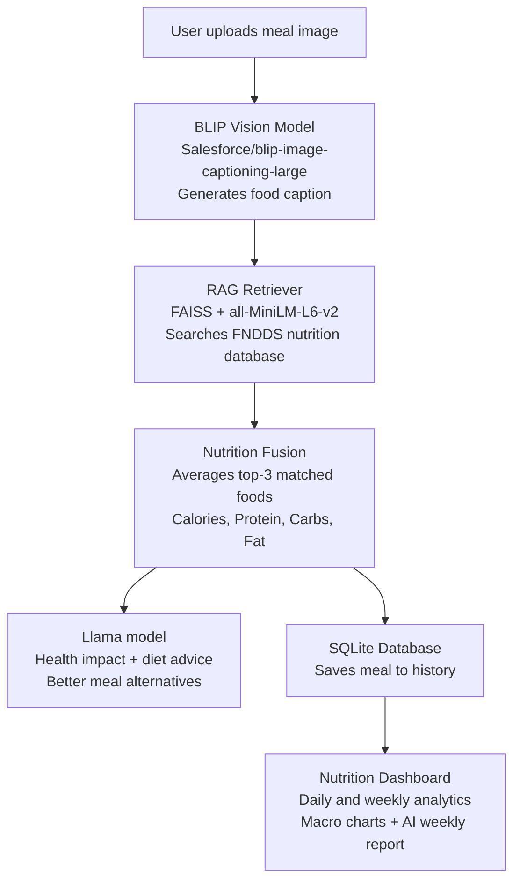

# 🍽️ AI Dietary Intelligence System

An end-to-end AI-powered diet tracking app that detects food from images, retrieves nutritional data using RAG, generates personalized diet advice using Gemini, and tracks your meal history with analytics.

---

## ✨ Features

- **Food Detection** — Upload a meal photo; BLIP vision model identifies what you ate
- **RAG Nutrition Lookup** — FAISS vector search retrieves matching nutrition data from the FNDDS food database
- **AI Diet Advice** — Llama model gives health impact, diet tips, and better meal alternatives
- **Meal History** — Every meal is saved to a local SQLite database automatically
- **Nutrition Dashboard** — Visual analytics: daily calories, weekly trends, macronutrient balance, and diet health indicator
- **Weekly AI Report** — Gemini generates a personalized weekly diet plan based on your logged intake

---

## 🧠 Architecture



---

## 🗂️ Project Structure

```
food_detector/
    app.py                  <- Streamlit UI (Upload Meal + Analytics pages)
    blip_model.py           <- BLIP image captioning model
    rag_retriever.py        <- FAISS semantic search + nutrition parsing
    gemini_recommender.py   <- Gemini AI meal and weekly recommendations
    database.py             <- SQLAlchemy models + SQLite setup
    build_rag_db.py         <- One-time script to build FAISS index from FNDDS data
    vector_search.py        <- Standalone vector search utility
    fndds.xlsx              <- FNDDS food nutrition dataset
    fndds_rag.faiss         <- Pre-built FAISS index (generated by build_rag_db.py)
    fndds_docs.pkl          <- Serialized nutrition documents (generated by build_rag_db.py)
    diet.db                 <- SQLite meal history database (auto-created)
    requirements.txt        <- Python dependencies
    .env                    <- API keys (never commit this)
    portion_estimator.py    <- Depth Estimation model to detect portion size
    README.md
```

---

## 🚀 Quick Start

### 1. Clone the repository

```bash
git clone https://github.com/your-username/food-detector.git
cd food-detector
```

### 2. Create and activate a virtual environment

```bash
# Windows
python -m venv .venv
.venv\Scripts\activate

# macOS / Linux
python -m venv .venv
source .venv/bin/activate
```

### 3. Install dependencies

```bash
pip install -r requirements.txt
```

> First run will download two models automatically:
> - `Salesforce/blip-image-captioning-large` (~900MB)
> - `all-MiniLM-L6-v2` (~90MB)
>
> Both are cached locally after the first download.

### 4. Set up your Groq API key

Create a `.env` file in the project root:

```
GROQ_API_KEY=your_gemini_api_key_here
```


### 5. Build the RAG database (first time only)

The FAISS index and document store are pre-built and included (`fndds_rag.faiss` and `fndds_docs.pkl`). If you need to rebuild from the raw Excel data:

```bash
python build_rag_db.py
```

### 6. Run the app

```bash
python build_rag_db.py (this automatically creates fndds_doocs.pkl,fndds_rag.faiss files)
streamlit run app.py
```

---

## 📱 Usage

### Upload Meal page
1. Upload a food image (JPG, PNG, JPEG, JFIF)
2. Click **Analyze Meal**
3. The app detects the food, retrieves nutrition info, and shows AI diet advice
4. The meal is automatically saved to your history

### Nutrition Analytics page
- View total and daily calorie intake
- Weekly nutrition trends (line chart)
- Macronutrient balance (area chart)
- Diet health indicator (low / balanced / high)
- AI-generated weekly diet plan

---

## 🛠️ Tech Stack

| Component | Library / Model |
|---|---|
| UI | `streamlit` |
| Food detection | `Salesforce/blip-image-captioning-large` via `transformers` |
| Embeddings | `sentence-transformers/all-MiniLM-L6-v2` |
| Vector store | `faiss-cpu` |
| Nutrition dataset | FNDDS (Food and Nutrient Database for Dietary Studies) |
| AI recommendations | `Llama` via `google-genai` |
| Database | SQLite via `SQLAlchemy` |
| Data processing | `pandas`, `numpy` |
| Environment | `python-dotenv` |

---

## 📊 Dataset

The app uses the **FNDDS (Food and Nutrient Database for Dietary Studies)** dataset (`fndds.xlsx`) which contains nutritional values per 100g for thousands of food items including Calories (kcal), Protein (g), Carbohydrates (g), and Fat (g).

---

## ⚙️ How RAG Works

1. `build_rag_db.py` reads the FNDDS Excel file and embeds each food description using `all-MiniLM-L6-v2`
2. Embeddings are stored in a FAISS flat L2 index (`fndds_rag.faiss`)
3. At query time, the BLIP caption is embedded and the top-3 nearest food items are retrieved
4. Nutritional values from the top-3 matches are averaged (nutrition fusion) to produce a robust estimate
5. Portion size is estimated using MiDas Segmentation model

---

## 🔒 Environment Variables

| Variable | Required | Description |
|---|---|---|
| `GROQ_API_KEY` | Yes | GROQ API key for diet recommendations |

---

## 🐛 Common Issues

**BLIP model is slow on first run**
The BLIP large model (~900MB) downloads from HuggingFace on first use and is cached locally after that. For faster inference, switch to `Salesforce/blip-image-captioning-base` in `blip_model.py`.

**`RAG index not found` error**
Run `python build_rag_db.py` to regenerate `fndds_rag.faiss` and `fndds_docs.pkl`.

**Groq API error**
Make sure your `.env` has no quotes: `GROQ_API_KEY=your_key` not `GROQ_API_KEY="your_key"`.

**`diet.db` not found**
The SQLite database is created automatically on first run — no action needed.

---

## 🔒 .gitignore

```
.env
.venv/
__pycache__/
*.pyc
diet.db
fndds_rag.faiss
fndds_docs.pkl
fndds.xlsx
```

> The FAISS index, pickle file, and dataset are large binary files. Add them to `.gitignore` and document how to regenerate them, or use Git LFS to track the FAISS and pickle files.

---

## 📜 License

MIT — free to use, modify, and distribute.